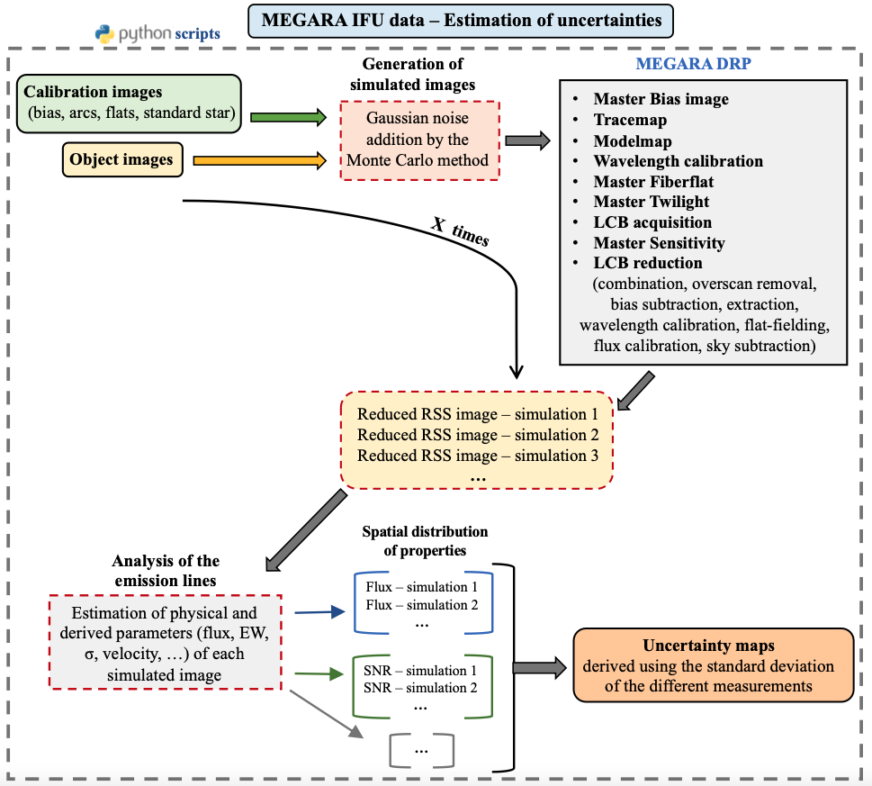

# MEGARA

This is the source code repository for the python routines employed to automatically reduce and analyze the data from the MEGARA IFU instrument at GTC, 
including the method developed to estimate the random uncertainties associated to the emission line properties.

This software was created by C. Cabello as part of her thesis work, developed under the supervision of N. Cardiel and J. Gallego, at the Departamento de Física de la Tierra y Astrofísica of the Universidad Complutense de Madrid.

The program is first mentioned in Cabello, C. - PhD Thesis 2023, and Cabello et al. 2023 in prep.

Maintainer: Cristina Cabello, criscabe@ucm.es Webpage (source): https://github.com/criscabe/MEGARA

</a>

